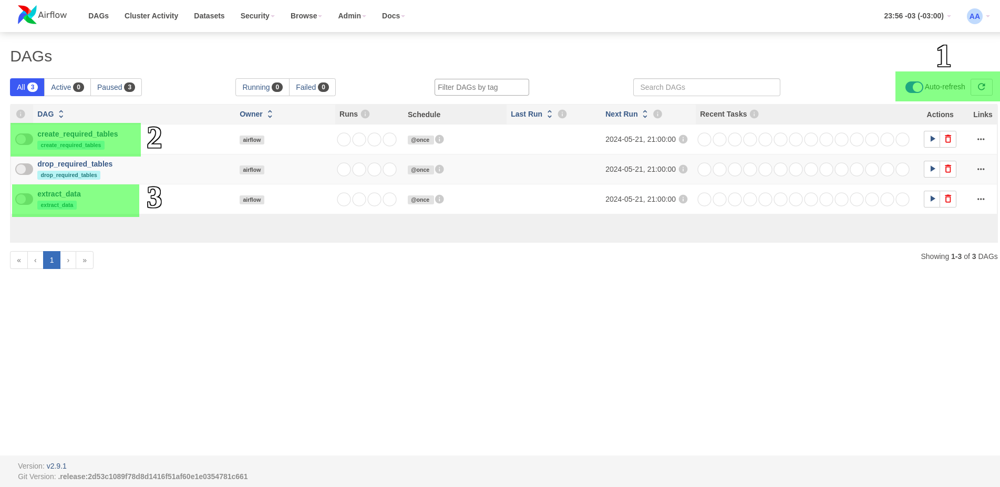
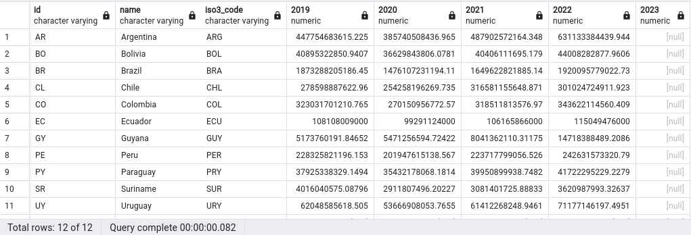

# CW Challenge

## This project is responsible for a data ingestion pipeline and generate a report.


The project use airflow to extract data from an API, transform and generate a report, to run the project is needed the requirements bellow:

- [docker](https://www.docker.com/get-started/)
- [docker compose](https://docs.docker.com/compose/install/)


On Linux, to start the application we need run the script <b>airflow_init</b>:
```bash
$ ./init_orchestrator.sh
```

On Windows environment, to start the application we need create an **.env** file with this informations:

```text
AIRFLOW_UID=1000
DB_CONNECTION=airflow-db
DB_DATABASE=postgres
```
Created the **.env** file, now we need run the commands bellow to start the application:
```bash
$ docker compose up airflow-init
```
and

```bash
$ docker compose up
```

To access the UI of airflow, go to http://localhost:8080 and use **airflow** as username and password

Before run the airflow DAGs, let's create the database connection, accessing the top bar, go to **Admin** option and find **Connections**:


Inside connections, we'll set the database connection

- **Connection Id -> airflow-db**
- **Connection Type -> Postgres**
- **Host** -> **172.17.0.1**
- **Database -> postgres**
- **Login -> airflow**
- **Password -> airflow**
- **Port -> 5440**

After put the informations above, click in save, congrats! your connection was created, now we can run the DAGs and make the challenge!

In the image bellow, we can see the steps to run the application, 1 - activate the auto-refresh (will help us to see the dags running), 2 - activate the first dag to create the required tables and 3 - activate the dag responsible for extraction and report creation.




With the dags steps completed, we can access the report connecting on database with the credentials above, you can use tools like pgadmin or Dbeaver and so, access the table **report** to see the data.


